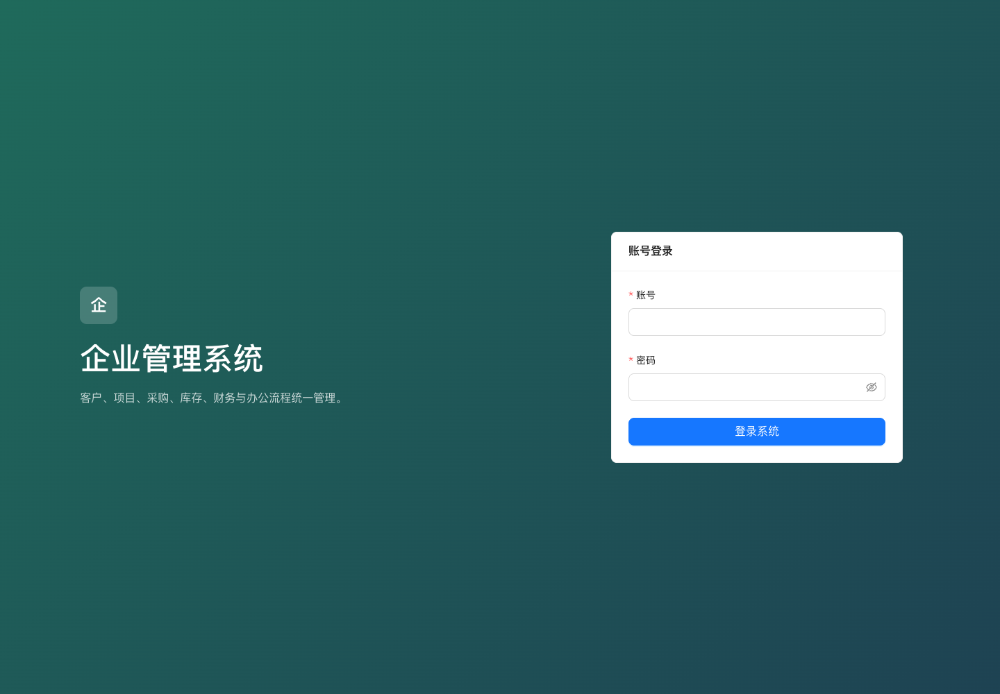
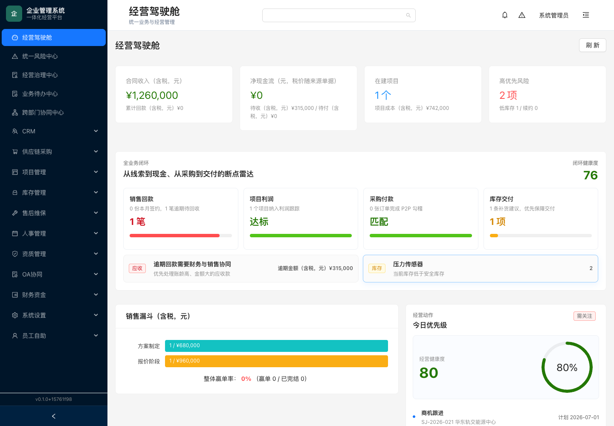
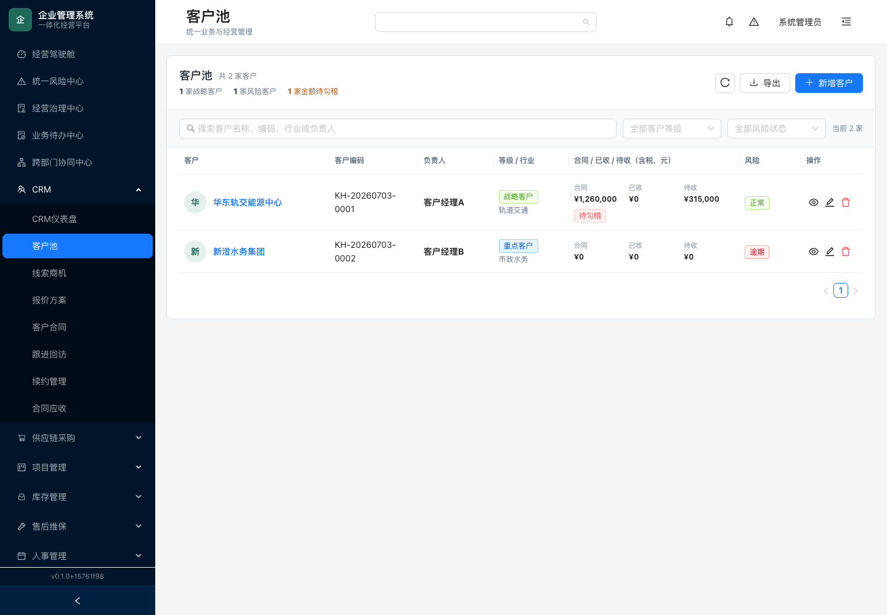
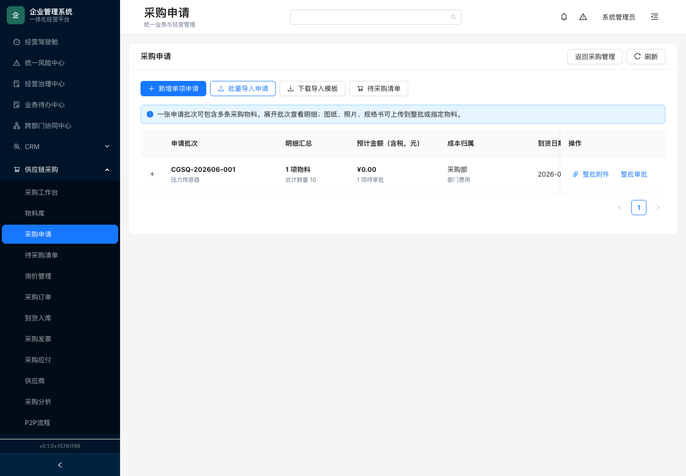
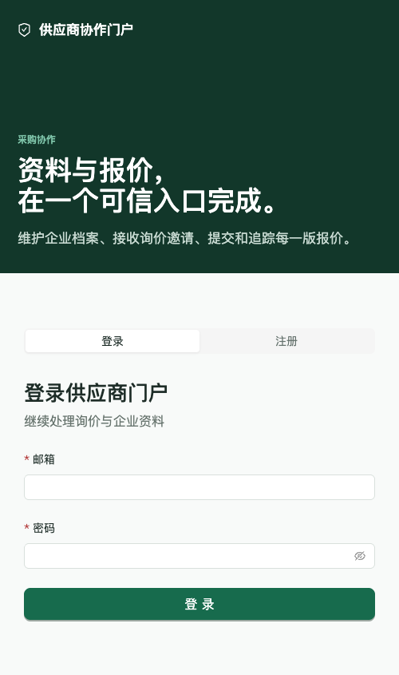
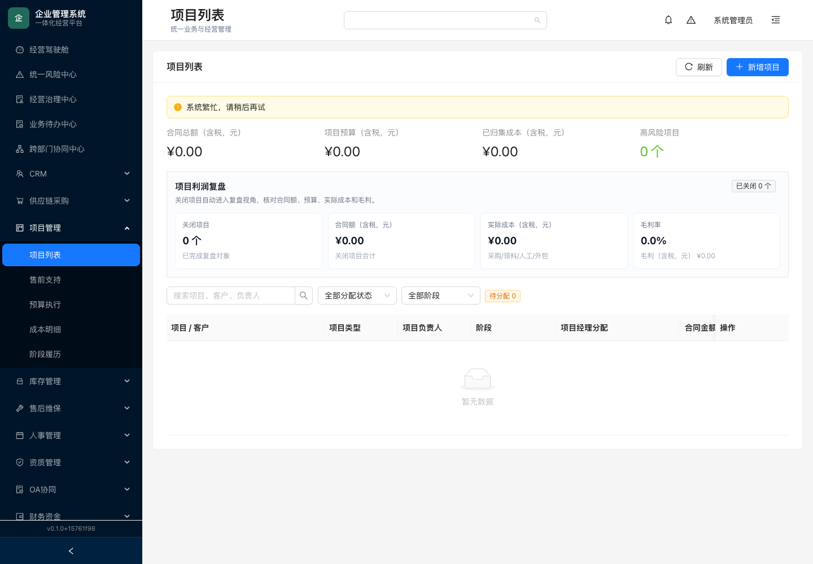
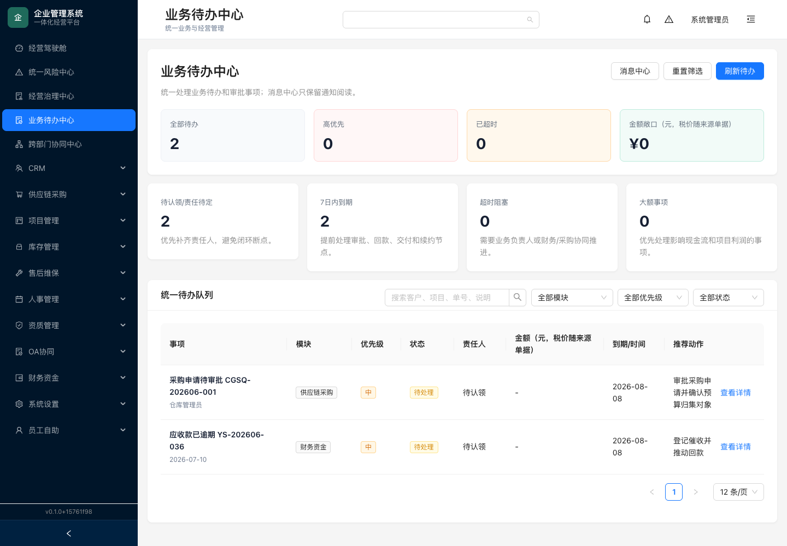
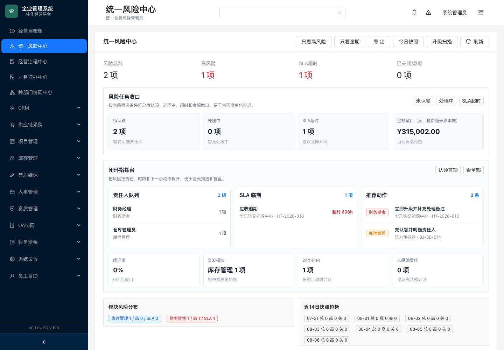
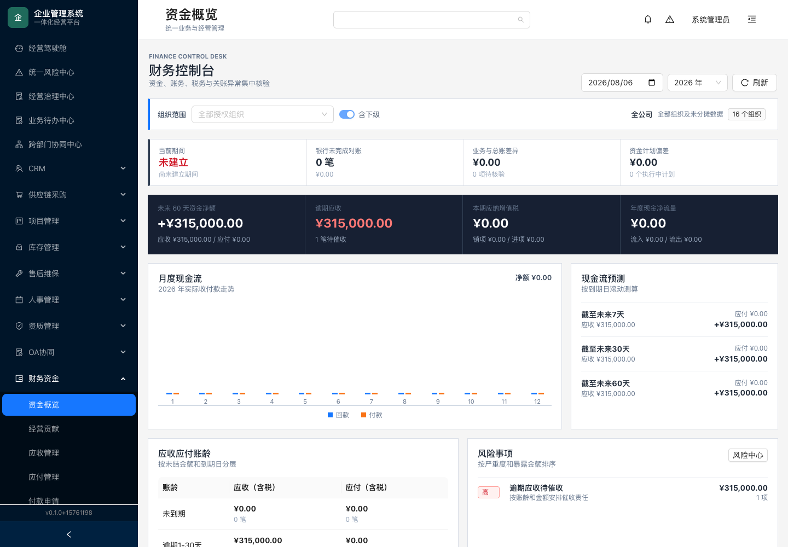
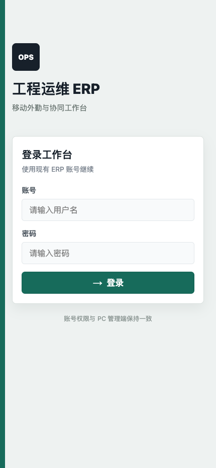

# Engineering Ops ERP 超详细使用教程（带截图）

> 适用对象：系统管理员、销售、采购、项目经理、仓库、财务、HR、供应商和移动办公人员
>
> 当前版本：以本地运行的 `apps/admin` 管理后台为准
> 更新日期：2026-08-06

这是一份“照着做就能完成业务”的操作手册。文中的菜单名称、按钮名称和截图均来自当前系统；截图中的客户、合同和金额是演示数据，实际环境会不同。

## 目录

1. [先记住这几个地址](#1-先记住这几个地址)
2. [第一次启动与登录](#2-第一次启动与登录)
3. [认识系统界面](#3-认识系统界面)
4. [每天如何开始工作](#4-每天如何开始工作)
5. [销售到回款：CRM 完整闭环](#5-销售到回款crm-完整闭环)
6. [采购到付款：供应链完整闭环](#6-采购到付款供应链完整闭环)
7. [项目、库存和售后维保](#7-项目库存和售后维保)
8. [待办、审批与协同](#8-待办审批与协同)
9. [风险中心：从发现异常到关闭](#9-风险中心从发现异常到关闭)
10. [财务资金操作](#10-财务资金操作)
11. [人事、资质和员工自助](#11-人事资质和员工自助)
12. [供应商门户与移动端](#12-供应商门户与移动端)
13. [系统设置与安全管理](#13-系统设置与安全管理)
14. [常见问题和排查顺序](#14-常见问题和排查顺序)
15. [上线验收清单](#15-上线验收清单)

## 1. 先记住这几个地址

| 入口 | 默认地址 | 谁使用 |
| --- | --- | --- |
| PC 管理后台 | `http://localhost:5174` | 管理员、销售、采购、项目、仓库、财务、HR |
| 供应商门户 | `http://localhost:5176` | 供应商注册、维护资料、参与询价 |
| 移动 H5 / 小程序调试 | `http://localhost:5180` | 审批、工单、签到、现场作业 |
| 后端 API | `http://localhost:8080/api` | 系统集成和排查，不给普通业务人员使用 |
| Swagger UI | `http://localhost:8080/swagger-ui` | 开发、实施和接口联调 |
| MinIO 控制台 | `http://localhost:9001` | 运维查看附件存储 |

开发环境默认管理员账号：

| 项目 | 账号 | 密码 |
| --- | --- | --- |
| 管理后台 | `admin` | `Admin@123` |

生产环境必须立即修改默认密码、JWT 密钥、数据库密码和对象存储密钥。不要把开发账号交给供应商或普通员工。

## 2. 第一次启动与登录

### 2.1 启动本地环境

在仓库根目录执行：

```bash
npm install
npm run deps:install
npm run infra:up
npm run api:dev
npm run admin:dev
```

看到管理端 Vite 输出 `http://localhost:5174` 后，用浏览器打开地址。PostgreSQL、Redis、MinIO 必须先启动，否则页面可能能打开但列表无法加载。

### 2.2 登录步骤

1. 打开 `http://localhost:5174/login`。
2. 在“账号”输入框填写用户名。
3. 在“密码”输入框填写密码；点击眼睛图标可暂时显示密码。
4. 点击“登录系统”。
5. 登录成功后会进入“经营驾驶舱”；如果之前访问了某个业务地址，系统会回到原页面。



### 2.3 登录后立刻做的三件事

1. 点击右上角“系统管理员”→“个人设置”，修改默认密码。
2. 在“系统设置→账号管理”确认用户的姓名、部门、角色和启用状态。
3. 用一个普通角色账号重新登录，确认它只能看到授权菜单。管理员能看到全部菜单，不代表普通角色也能看到。

### 2.4 登录失败怎么判断

- “账号或密码错误”：检查大小写和键盘输入；连续失败会触发登录限流。
- 登录后立刻回到登录页：通常是令牌失效，重新登录；若所有账号都这样，检查 API 是否可用。
- 页面显示“无权限”：账号已登录，但角色缺少对应 permission；交给管理员在角色管理中补权。
- 不要通过浏览器开发者工具手动修改令牌。修改密码、重置密码或停用账号会让旧令牌立即失效，这是设计行为。

## 3. 认识系统界面

### 3.1 首页看什么

经营驾驶舱显示销售回款、项目利润、采购付款、库存交付、逾期应收、低库存和商机跟进等摘要。卡片可以点击进入对应业务页面；“刷新”只刷新当前页面数据，不会改变数据库。



### 3.2 页面五个固定区域

| 区域 | 用法 |
| --- | --- |
| 左侧菜单 | 按模块进入业务；点击模块标题展开二级菜单 |
| 顶部标题 | 显示当前路由和页面名称 |
| 全局搜索 | 搜客户、项目、合同、采购订单、工单等业务对象 |
| 消息中心 | 查看当前用户的通知和未读数量 |
| 用户菜单 | 个人设置、角色信息、退出登录 |

左侧菜单可以折叠。折叠后只显示图标，鼠标悬停可看到菜单提示；在小屏幕上菜单会自动收起。

### 3.3 当前系统菜单地图

| 菜单 | 主要页面 | 典型负责人 |
| --- | --- | --- |
| 经营驾驶舱 | 公司 KPI、趋势、利润、库存风险 | 管理层 |
| 统一风险中心 | 风险项、责任人、SLA、快照 | 管理层、内控 |
| 业务待办中心 | 审批、逾期应收、待采购等跨模块待办 | 全员 |
| CRM | 客户、商机、报价、合同、跟进、续约、应收 | 销售、售前 |
| 供应链采购 | 采购申请、询价、订单、收货、质检、应付 | 采购、仓库 |
| 项目管理 | 项目、售前成本、预算、阶段、成本明细 | 项目经理 |
| 库存管理 | 物料、流水、领退料、库存分析 | 仓库 |
| 售后维保 | 工单、设备、计划、派工、签到、验收 | 服务主管、工程师 |
| 人事管理 | 员工、入转调离、请假、额度、分析 | HR |
| 资质管理 | 公司资质、人员证书、业绩、投标、预警 | 资质专员 |
| OA 协同 | 报销、出差、用印、外包、档案、消息、审计 | 全员、行政、财务 |
| 财务资金 | 资金、应收、应付、付款、总账、税务 | 财务 |
| 系统设置 | 用户、组织、角色、权限、审批配置、健康检查 | 系统管理员 |
| 员工自助 | 我的档案、请假、审批、余额 | 普通员工 |

## 4. 每天如何开始工作

建议所有岗位形成固定顺序：

1. 登录后台，先看顶部消息角标。
2. 打开“业务待办中心”，按“待处理”筛选并处理有明确截止时间的事项。
3. 打开“统一风险中心”，先看“高风险”“SLA 超时”“未认领”。
4. 回到自己的业务模块，完成新增、审批、回款、收货或工单动作。
5. 处理完后点击“刷新”，确认状态和责任人已经变化。
6. 下班前再次检查待办和风险，不要只依赖消息提醒。

### 4.1 待办和风险的区别

- 待办中心回答“我今天要做什么”。例如：采购申请待审批、应收款已逾期。
- 风险中心回答“哪些异常必须被收口”。例如：高风险逾期、低库存、SLA 超时。
- 同一个业务对象可能同时出现在两个中心；在待办完成审批后，风险项仍可能需要单独认领、填写处理意见并关闭。

## 5. 销售到回款：CRM 完整闭环

### 5.1 推荐顺序

```text
客户池 → 线索商机 → 报价方案 → 成本测算 → 报价审批
→ 客户结果 → 合同 → 合同审批/签署 → 应收 → 开票 → 回款
```

不要跳过客户和商机直接手工建合同，否则后续利润、应收和销售漏斗会缺少关联来源。

### 5.2 建立客户档案

入口：`CRM→客户池`。



操作步骤：

1. 点击右上角“新增客户”。
2. 填写客户名称、行业、等级、负责人；客户编码通常由系统生成，不能重复。
3. 填写开票资料：发票抬头、税号、开户行、账号等。暂时未知的字段按页面提示留空，不要写“无”。
4. 在联系人区域填写姓名、职务、电话、邮箱，至少保留一名可联系人员。
5. 填写项目地址和客户备注；敏感资料只上传到对应客户档案。
6. 点击“确定/保存”，回到列表确认客户已出现。
7. 点击客户名称进入“客户全景详情”，检查商机、合同、应收、跟进和附件页签。

搜索和筛选：

- 搜索框支持客户名称、编码、行业和负责人。
- “客户等级”用于区分战略客户、重点客户和普通客户。
- “风险状态”用于筛选正常、逾期、续约风险等客户。
- “导出”生成 CSV；导出前先设置筛选条件，避免把全部客户资料下载到个人电脑。

### 5.3 创建和推进商机

入口：`CRM→线索商机`。

1. 点击“新增商机”，选择客户，填写商机名称、预计金额、预计成交日期、负责人和来源。
2. 按真实进展推进阶段：线索→跟进→方案→谈判→成交/流失。
3. 每次推进都填写备注和下一步计划，避免只改阶段不留过程。
4. 成交前检查客户、金额、预计日期和负责人；成交后再创建报价或合同。

### 5.4 报价、成本和审批

入口：`CRM→报价方案`。

1. 从商机创建报价，填写报价明细、税率、付款条件、有效期和交付说明。
2. 如果需要项目/售前测算，在报价详情点击“发起成本请求”。
3. 测算人员填写人工、材料、外包、差旅、设备、风险准备金和其他成本。
4. 成本提交后由有权限人员审批；驳回时必须写明原因。
5. 销售确认建议售价和毛利率后，点击“提交审批”。
6. 审批通过后记录客户结果：接受、拒绝或待定；接受的报价才能转换合同。
7. 每次修改保留修订记录，不要在审批后直接覆盖历史报价。

### 5.5 合同、应收和续约

1. 在报价详情点击“转换合同”，核对客户、金额、付款计划和关联商机。
2. 合同待审批时可以修订；生效后如需改金额、期限或付款条款，必须发起“合同变更”并重新审批。
3. 合同签署文件走签署审批，原文件和变更文件都上传到合同附件。
4. 合同生成应收后，财务在“应收管理”申请开票、登记发票和回款。
5. 回款后核对已收、待收和核销状态；逾期记录会同步至风险中心。
6. 到期前进入“续约管理”，填写续约建议和下一次跟进日期。

## 6. 采购到付款：供应链完整闭环

### 6.1 推荐顺序

```text
供应商准入 → 采购申请 → 申请审批 → 询价/报价 → 定标
→ 采购订单 → 到货 → 质检 → 入库/退换货 → 采购应付
→ 付款申请 → 付款审批 → 执行付款
```

### 6.2 新建采购申请

入口：`供应链采购→采购申请`。



1. 点击“新增单项申请”；批量导入时先点击“下载导入模板”。
2. 选择物料或服务，填写数量、单位、期望到货日期、预算单价和税率。
3. 选择成本归属：项目、部门或其他业务对象；这一步决定后续成本归集。
4. 填写申请理由和附件，附件中不要放与申请无关的个人信息。
5. 保存草稿后检查明细，再点击“提交审批”。
6. 在列表中确认批次号、金额、到货日期和“待审批”状态。
7. 审批通过后进入“待采购清单”；未审批通过的申请不能下采购订单。

批量导入注意：物料编码、数量、日期格式必须与模板一致；导入失败先下载错误明细，不要重复导入造成重复申请。

### 6.3 询价和双通道报价

入口：`供应链采购→询价管理`。

1. 选择已准入且未冻结的供应商，设置询价截止时间和报价要求。
2. 生成邀请后，邀请码只展示一次；“待人工发送”只代表邀请已创建，不代表消息已送达。
3. 供应商可以在门户保存草稿、上传报价附件、提交、撤回、放弃响应或发起澄清。
4. 采购员也可以代录分项价格、税率、交期和商务条款；代录报价要等供应商确认。
5. 截止前可调整正在进行的询价截止日期，调整后保留操作留痕。
6. 内部人员分别填写技术评分和商务评分；供应商看不到内部评分。
7. 只对“已提交”版本进行比价和定标，草稿不参与最低报价计算。
8. 供应商重新提交会生成新版本和快照，比较时核对版本号、附件和提交时间。

供应商门户登录页如下。供应商注册、绑定邀请码、维护资料和参与询价都在这个独立入口完成。



### 6.4 下单、收货、质检和关单

1. 定标后生成采购订单，核对供应商、物料、数量、价格、税率、交期和付款条件。
2. 订单下单后，采购员在“到货入库”登记实际到货批次和数量。
3. 质检填写合格数量、不合格数量和检验结论；合格数量才能入库。
4. 不合格数量进入退换货，必须记录换货、折让或索赔中的至少一项。
5. 换货会生成待质检的替换到货记录，替换批次也必须重新质检。
6. 到货、质检、退换货全部完成后才能关闭订单；有待质检或未结案退换货时系统会拒绝关单。
7. 已取消或已关闭的订单不能继续质检和入库；已经有到货记录的订单不能直接取消。

### 6.5 P2P 勾稽和采购应付

在 `供应链采购→P2P流程` 检查申请、订单、收货、质检和应付是否匹配。三单或多单不一致时，先处理数量、价格、税率或供应商差异，再向财务提交付款。

## 7. 项目、库存和售后维保

### 7.1 项目管理

入口：`项目管理→项目列表`。



推荐操作：

1. 报价转合同后创建项目，关联客户和合同。
2. 提交立项审批；审批通过后分配项目经理。
3. 按“启动、执行、验收、质保”等阶段推进，每次填写阶段说明。
4. 在成本明细中归集人工、材料、差旅和外包；成本会影响项目利润。
5. 项目完成验收后核对合同额、实际成本、毛利和余额，再关闭项目。

### 7.2 库存

- `库存台账`：维护物料编码、规格、单位、单价、安全库存和当前库存。
- `库存移动`：查询入库、出库、盘盈、盘亏和调整流水；不要直接改库存数字。
- `领料管理`：项目或工单领料；未使用物料通过退料单回库。
- `库存分析`：关注低库存、补货建议和库存资产。

库存低于安全库存会产生补货建议和风险项。处理补货建议后，仍需在风险中心认领并记录原因，不能只采购不关闭风险。

### 7.3 售后维保

工单推荐状态顺序：创建→派工→接单→到场签到→处理中→完工→客户验收→关闭。

- 完工必须填写服务结果、耗材和现场照片。
- 现场签到需要移动端定位权限；弱网时先离线保存，网络恢复后补传。
- 非质保且应计费的工单在客户验收后自动生成应收。
- 质保工单不要手工创建重复应收；发现重复时先联系财务和服务主管。

## 8. 待办、审批与协同

### 8.1 业务待办中心

入口：`业务待办中心` 或 `/workbench/todos`。



1. 用模块、优先级、状态和关键词缩小范围。
2. 先处理截止日期最近、金额最大或高优先级事项。
3. 点击“查看详情”进入来源业务对象，完成实际动作后返回待办中心刷新。
4. 仅查看详情不会完成待办；必须完成审批、认领、登记回款等业务动作。

### 8.2 审批处理规则

审批可以按金额、部门、业务类型、项目、供应商风险和客户等级匹配多级节点。

- 申请人：创建并提交审批，可在未处理前撤回。
- 当前审批人：通过、驳回、退回、转交或加签。
- 转交：当前节点改由另一位审批人处理。
- 加签：增加协同审批人，原审批链仍保留。
- 通过/驳回：必须填写意见，驳回意见要能指导重新提交。
- 被退回后：申请人修改业务单，再重新提交，不要新建重复单据。

申请人不能审批自己的申请；付款申请的申请、审批和执行必须由不同人员完成。

### 8.3 消息中心

顶部角标每 30 秒刷新一次。消息已读状态按用户独立保存；标记已读不会影响其他人的未读数量。审批、风险和逾期提醒只投递给相关人员，不会因为接收人解析失败而公开给全员。

## 9. 风险中心：从发现异常到关闭

入口：`统一风险中心` 或 `/risk-center`。



### 9.1 标准处理动作

1. 点击“只看高风险”或“只看逾期”，先缩小处理范围。
2. 查看风险事项、来源单号、金额、到期日、责任人和 SLA。
3. 对未认领事项点击“认领首项”或在行内分配责任人。
4. 填写处理备注、根因、纠正措施和预防措施；不要只写“已处理”。
5. 处理后将状态改为“处理中”；确认业务证据齐全后再关闭。
6. 使用“今日快照”保存当天风险基线；用“升级扫描”检查 SLA 超时项。
7. 定期查看闭环率、复发模块和 14 日趋势，识别重复发生的流程问题。

### 9.2 关闭前检查

- 逾期应收：必须有催收记录、客户承诺日期或回款凭证。
- 低库存：必须有补货单、替代物料或明确的交付风险说明。
- 资质到期：必须上传续证材料或记录不可续证原因。
- 审批超时：必须完成处理或升级到上级责任人。

关闭风险只改变治理状态，不会替代原模块的业务状态。比如关闭“采购申请待审批”风险，不等于采购申请已经审批通过。

## 10. 财务资金操作

### 10.1 资金概览

入口：`财务资金→资金概览`。



先选择财务日期、年度和授权组织，再点击“刷新”。页面重点看：当前会计期间、银行对账、业务与总账差异、未来 7/30/60 天现金流和账龄。

### 10.2 应收

1. 在 `应收管理` 打开来源为合同或工单的应收。
2. 申请开票并登记发票号码、税率、开票日期和附件。
3. 收款后登记回款日期、金额、银行流水号和核销对象。
4. 若部分回款，按实际金额登记，不要把未收金额填成 0 回款。
5. 逾期应收要同步登记催收动作，并在风险中心认领。

### 10.3 应付和付款申请

1. 在 `应付管理` 核对供应商、来源单据、金额、税额和三单匹配。
2. 付款申请岗创建付款申请，填写收款账户、付款用途和附件。
3. 付款审批岗审核申请，申请人不能审批自己的申请。
4. 付款执行岗确认银行流水号、付款日期和实际金额后执行付款。
5. 付款成功后核对应付状态、现金流和自动凭证。

### 10.4 总账、关账和对账

- 手工凭证按制单→复核→记账推进；制单人不能复核自己的凭证。
- 会计期间关账前检查未记账凭证、高风险控制事项和未对账银行流水。
- 强制关账、反结账需要双人复核并填写原因。
- 已关账日期禁止新增或修改凭证；发现错误应走冲销和补录，不要直接改历史凭证。

## 11. 人事、资质和员工自助

### 11.1 人事

员工中心维护员工档案、证书、合同和紧急联系人；入转调离记录岗位变化；请假管理处理申请和审批；请假额度页面初始化或调整余额；人力分析查看人员结构和工时。

### 11.2 资质

1. 在“公司资质”上传证书、等级、专业、有效期和附件。
2. 在“员工中心”维护人员证书和合同有效期。
3. 在“投标查询”按专业和注册状态筛选可用人员。
4. 在“预警中心”处理即将到期和已过期项目。
5. 资质附件统一由后端检查大小、扩展名和路径安全；不要通过文件名拼接路径。

### 11.3 员工自助

普通员工只处理自己的档案、请假、审批待办和余额。员工自助的可见范围由当前登录用户绑定的员工档案决定，不能通过修改 URL 查看其他人的资料。

## 12. 供应商门户与移动端

### 12.1 供应商门户

入口：`http://localhost:5176`。


供应商首次使用：

1. 在登录页切换到“注册”，填写企业邮箱、密码和基本资料。
2. 使用采购邀请生成的一次性注册码绑定已有供应商主档；注册码有效期 7 天，只显示一次。
3. 等待内部人员审核门户账号和供应商准入。账号审核通过不等于已准入。
4. 账号启用、供应商准入通过、未被冻结且完成首次改密后，才能看到受邀询价。
5. 在“资料”维护企业信息和资质附件；在“询价”保存报价草稿、上传附件、提交或撤回。
6. 采购员代录的报价必须由供应商确认后才进入定标统计。

### 12.2 移动 H5 / 微信小程序

入口：`http://localhost:5180`（H5 调试）或微信开发者工具导入 `apps/mobile/dist/dev/mp-weixin`。



移动端常用操作：

- 审批：查看待办、打开详情、通过/驳回、填写意见。
- 消息：查看通知并标记已读。
- 请假/报销/出差：提交申请并查看历史状态。
- 工单：接单、改派、定位签到、上传现场照片、登记材料、客户签字和完工。
- 弱网：先离线保存，网络恢复后点击补传；补传前不要重复创建同一条工单记录。

生产发布前必须替换小程序 AppID，配置 HTTPS API 域名、AppSecret、上传下载合法域名和隐私声明。

## 13. 系统设置与安全管理

### 13.1 用户、组织、角色、权限

1. 先在“组织架构”建立部门和组织层级。
2. 在“角色管理”按岗位创建角色，分配最小必要权限。
3. 在“账号管理”创建用户、绑定角色、设置部门和启用状态。
4. 用普通账号验证菜单和按钮是否按预期隐藏。
5. 离职或停用账号后，旧 JWT 会立即失效；同时检查待办和审批是否需要转交。

### 13.2 审批与流程配置

流程配置支持条件匹配、多级节点、转交、加签、撤回、发布、回滚和诊断。修改流程前先复制当前版本；发布后用一笔低金额演示单验证每个节点。

### 13.3 操作审计和回收站

- `OA协同→操作审计`：按用户、模块、对象、HTTP 方法、状态码和时间查询操作。
- `系统设置→删除回收站`：查看软删除记录，审批恢复或彻底删除。
- 审计默认保留 365 天；生产环境应按合规要求设置 `AUDIT_RETENTION_DAYS`。

### 13.4 附件和数据安全

附件只通过业务页面上传；生产推荐 MinIO/S3。数据库保存元数据，文件存储服务保存原文件。不要把生产附件目录暴露为静态目录，也不要在聊天工具中传递带客户身份证、银行账号或合同扫描件的截图。

## 14. 常见问题和排查顺序

### 14.1 页面打不开

1. 确认前端端口：`lsof -iTCP:5174 -sTCP:LISTEN`。
2. 确认 API：打开 `http://localhost:8080/actuator/health`。
3. 确认基础设施：`docker compose -f infra/docker-compose.yml ps`。
4. 若只有某个列表报错，先点“刷新”，再查看浏览器网络请求的 HTTP 状态码。

### 14.2 401、403、数据为空

- 401：令牌过期或账号被停用，重新登录。
- 403：角色缺少权限，交给管理员核对 permission。
- 空列表：检查筛选条件、组织范围、分页页码和数据是否已审批通过。
- 金额不一致：先核对含税/未税、发票、回款核销和币种，再看聚合页面。

### 14.3 审批找不到人

检查组织、角色、审批人员配置、流程是否已发布，以及条件字段是否匹配。修改配置后必须用测试单验证；不要直接给所有用户授予管理员角色。

### 14.4 附件上传失败

检查文件大小、扩展名、网络和对象存储状态。不要只改文件后缀绕过白名单；如怀疑路径问题，保留请求 ID 交给运维排查。

### 14.5 采购不能取消或关单

有到货、待质检或未结案退换货时，这是系统的业务保护。按“质检→退换货结案→关闭订单”的顺序处理；已有到货的订单不能直接取消。

### 14.6 财务不能付款或关账

付款检查申请人、审批人、执行人是否为三人分离；关账检查未记账凭证、风险控制事项和银行对账。已关账日期不要直接改凭证。

## 15. 上线验收清单

管理员按下面顺序做一次完整演练：

- [ ] 默认管理员已改密，JWT、数据库和 MinIO 密钥已替换。
- [ ] 普通角色只能看到授权菜单，越权接口返回 403。
- [ ] 客户→商机→报价→合同→应收→回款链路跑通。
- [ ] 采购申请→审批→询价→订单→收货→质检→入库→应付链路跑通。
- [ ] 不合格品退换货、换货二次质检和订单关单约束验证通过。
- [ ] 项目人工、材料、差旅、外包成本能进入利润摘要。
- [ ] 低库存、逾期应收、资质到期能进入风险中心并完成认领/关闭。
- [ ] 付款申请、审批、执行三岗分离验证通过，自动凭证已生成。
- [ ] 会计期间关账、反结账和银行对账留痕可查询。
- [ ] 供应商邀请码只能使用一次且过期失效，门户只能看到受邀询价。
- [ ] 移动端审批、定位签到、现场照片、客户签字和弱网补传验证通过。
- [ ] 附件下载、审计日志、回收站恢复和数据备份恢复演练通过。

## 附：截图与文档维护

截图由本地开发环境生成，文件位于 `docs/tutorial-assets/`。当菜单、字段或流程发生变化时，应重新运行管理端并更新对应截图，同时修改本文件的版本日期。系统技术实现、API、部署和备份细节请继续参考 [`docs/system-usage.md`](system-usage.md)、[`deploy/README.md`](../deploy/README.md) 和 [`docs/supplier-portal.md`](supplier-portal.md)。
